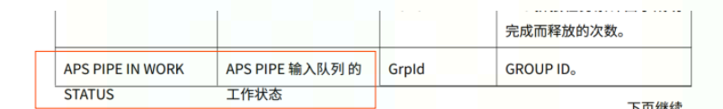

# RST写作技巧

## 基本语法

- 星号: *text* 是强调 (斜体)
- 双星号: **text** 重点强调 (加粗)
- 反引号: ``text`` 代码样式

## Latex公式

## 超链接

### 使用ref引用rst文件章节标题

```

.. _sdk_overview:
 
SDK概述
----------------

```

引用的地方：

```
sdk概述参见 :ref:`sdk_overview` 章节介绍。
```

### 给表格添加ref

```
1. 为表格添加独立引用标签

.. _table_version_info:
 
.. table:: 版本信息
 
2. 通过name方式为表格添加引用标签

.. table:: 版本信息
   :name: table_version_info
```   

### 使用ref引用无标题的内容

引用无标题段落也需要在段落之间添加引用标签，如下所示：

```
.. _sdk_flush:
 
```

引用的地方：

``` 
说明参见 :ref:`SDK flush说明<sdk_flush>` 的介绍。
```

### 列表的引用

内部引用方式写法如下：

```

* _`ABCD_YECS`

```

引用的地方：

```
:ref:`ABCD_YECS<ABCD_YECS>`

```

### 为表格或者章节的引用添加编号

```
#引用章节语法
:numref:`%s<引用标签>` :ref:`引用标签`
#引用表格语法
:numref:`表 %s:<引用标签>` :ref:`引用标签`
#引用图片语法
:numref:`图 %s:<引用标签>` :ref:`引用标签`

```

说明：

- numref引用为了添加编号。
- %s：sphinx会自动将%s替换为对应的编号。
- ref引用为了添加标题。之所以用ref添加标题，而不统一写在numref引用里，是为了当标题变化时，不用修改引用内容，增加引用的可维护性。

在conf.py配置文件中添加配置。章节和图片的引用类似，只是引用语法不同，不再赘述。

使表格和图片的编号由sphinx自动生成。添加的配置如下所示。该步骤是为了在引用表格或者图片时，能够添加表格和图片的序号。

```
numfig = True
numfig_secnum_depth = 1
```
说明：

- 该配置添加到conf.py的任何位置都可以。
- sphinx 3.5之后版本，这两个配置必须添加，否则将无法为表格和图片生成序号。因此为了兼容新版本，也建议增加该配置。该配置也兼容sphinx3.5之后版本。
- 增加该配置后，conf.json的"\\\\numberwithin{figure}{chapter}"和"\\\\numberwithin{table}{chapter}",两行配置可以删除，因为表格序号通过sphinx自动添加，不再通过修改tex文件的方式添加。

## 表格

### CSV表格

#### 引入CSV文件

语法示例：

```

 .. csv-table:: MLU CSV
 :file: ./operator.csv
 :header-rows: 1
 :widths: 10 20 30

```
```note
- 采用引入文件的方式，最好设置“widths”参数，否则当一行内容过长时表格的宽度可能超出页面的显示。
- 引入CSV文件时，最好采用相对目录。
- 因为CSV文件有后期维护的问题，因此不建议采用文件的方式，尽量直接在rst文件里写。
```

参数说明可参考 <https://docutils.sourceforge.io/docs/ref/rst/directives.html#csv-table>

#### 在rst文件中直接写CSV表格

语法示例：

```

.. csv-table:: MLU介绍
   :header: "序号","算子","类型"
   :widths: 10 20 30
 
   "1","Abs","int,float16"
   "2","Acos","int,float32"

```

参数说明可参考 <https://docutils.sourceforge.io/docs/ref/rst/directives.html#csv-table>

### 长表格

可以通过table 的class属性实现。示例如下：

```

.. tabularcolumns:: |p{0.2\textwidth}|p{0.2\textwidth}|p{0.4\textwidth}|p{0.4\textwidth}|
.. table:: K2拨码开关123和PCIe模式对应表
   :class: longtable
 
    +-------------+------------+-----------+-------------------------------------+
    |K2 1 value   | K2 2 value | K2 3 value|           PCIE模式                  |
    +=============+============+===========+=====================================+
    |     0       |     0      |     0     | connector0 x2EP, connector1 invalid |
    +-------------+------------+-----------+-------------------------------------+
    |     1       |     0      |     0     | connector0 x2RC, connector1 invalid |
    +-------------+------------+-----------+-------------------------------------+
    |     1       |     1      |     1     | connector0 x2RC, connector1 x2RC    |
    +-------------+------------+-----------+-------------------------------------+
    |     1       |     1      |     0     | connector0 x2RC, connector1 x2EP    |
    +-------------+------------+-----------+-------------------------------------+
	
```

示例中重点修改了：

1. tabularcolumns指令中\|m{0.2\textwidth}\|中的“m”修改为“p”，即\|p{0.2\textwidth}\|，必须修改为“p”否则class参数无效。

2. 添加“calss”参数，将“class”参数的值设置为“longtable”，即“:class: longtable”。

```warning
- 通过class设置为longtable，不能对表格的第一列进行渲染，只能对表格的第一行进行渲染，如果要对第一列进行渲染，还是需要采用其他方式设置。

- table添加了class、widths或者name参数后，表格的左边框必须和参数的最左边“:”对齐，否则表格会有编译异常。
```

### 调整表格caption宽度

当表格的表头过长时，会自动换行，表格的表头明显没有铺满整个表格的宽度，实际是没必要换行。以下方法通过调整表格表头的宽度，解决以上问题。

在conf.py配置文件的latex_elements变量的“preamble”字段中增加“\\LTcapwidth=500pt”的配置，修改后如下所示：


```

'preamble': '''
\\addto\\captionsenglish{\\renewcommand{\\chaptername}{}}
\\LTcapwidth=500pt

```

## 图片

## 源代码

## 替换


```note
## This is a note

Markdown is supported, Text can be **bold**, _italic_, or ~~strikethrough~~. [Links](https://github.com) should be blue with no underlines

`inline code`

[`inline code inside link`](./)
```


```note
This is note3
```

```tip
It’s bigger than a bread box.
```

```tip
It’s tip 2
```


```danger
Mad scientist at work!
```



