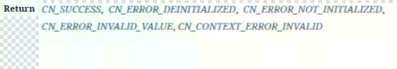
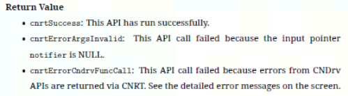

# Doxygen & Breathe 笔记

官网 <https://www.doxygen.nl/manual/index.html>

## 注释

- 简述（@brief)，简单介绍该接口的功能。

- 详述（@details），详细描述该接口的功能，使用业务场景，和该接口相关的其他接口。如果有公式，需要公式展示，介绍以及公式参数介绍。

- 参数说明（@param），属于出参“[out]”还是入参“[in]”，或者既是出参也是入参“[in,out]”，描述参数的含义、参数类型和取值范围、参数默认值、和参数相关联的数据类型或接口。

- 返回值（@return）或者（@retval）列举所有的返回值，链接到包含所有返回值的枚举。

  
  
  

- 注意事项（@note）
  使用该API需注意的事项，例如与该API配对使用的API，是否需要在其他API之前或之后调用该API等，例如，内存分配后，要求用户最好调用cnrtFree释放内存资源。分配的内存是否已初始化？接口调用时如何保证性能等。

- 环境依赖（@par Requirements）
  描述使用该函数需要的头文件、动态库或静态库。如果没有需要写 None，但不可以删除这个章节。

- 示例（@ par Example）

### 头文件中如何使用rst语法

如果能在头文件中使用rst语法，那么解决了在头文件中展示latex公式、图片、表格等问题。

设置如下：

1. 在Doxyfile配置文件中找到 ALIASES 变量，并设置如下：

   ```
   # Allow for rst directives and advanced functions e.g. grid tables
   ALIASES  = "rst=\verbatim embed:rst:leading-asterisk"
   ALIASES += "endrst=\endverbatim"
   ```
   这两个aliases来自Breathe，在“verbatim”下，用户来设置reStructuredText，如表格、latex公式等 。aliases会发送给Doxygen。
   
2. 在头文件中，添加 \rst 和 \endrst ，两个标签中间为rst内容。例如：

   ```
   * \rst
   * There is a :math:`N^2` environment for reStructuredText!
   *
   * +-------------------+-------------------+
   * | Grid Tables       | Are Beautiful     |
   * +===================+===================+
   * | Easy to read      | In code and docs  |
   * +-------------------+-------------------+
   * | Exceptionally flexible and powerful   |
   * +-------+-------+-------+-------+-------+
   * | Col 1 | Col 2 | Col 3 | Col 4 | Col 5 |
   * +-------+-------+-------+-------+-------+
   *
   * \endrst
   ```
### 头文件内引用

#### C struct, typdef, enum 引用：

```
::struct_name
::struct_value
\\typedef
::typedef_name
::enum_name
::enum_value
 
::function_name
```

```note
struct, enum值的引用，无需在引用时写struct或enum的名字。
```

#### C++ Class, struct, typdef引用：

```
namespace::class_name
namespace::struct_name
namespace::struct_name::struct_value
\\typedef
namespace::typedef_name
 
namespace::class_name::function_name
 
\\ If a function is overriding in a class
namespace::class_name::function_name()
```
如果所有类都同在一个namespace，会使文档中出现大量namespace名。所以建议隐藏namespace。设置参考namespace配置。

如果隐藏namespace，写法如下：

```
class_name
 
struct_name
 
struct_name::struct_value
 
\\typedef
::typedef_name
 
class_name::function_name
 
\\ If a function is overriding in a class
class_name::function_name()
```
#### C++ enum引用

```
namespace::enum_name
namespace::enum_value
```

如果所有enum都同在一个namespace，会使文档中出现大量namespace名。所以建议隐藏namespace。设置参考namespace配置。

```
::enum_name
::enum_value
```
```note
enum值引用不需要前面加enum的名字！
```

#### C++ Function引用

```
\\如果function为global不属于任何类
::function_name
 
\\如果function属于某个类
class_name::function_name
 
\\如果函数是重载函数，函数名后面加括号，会链接到某一个函数
::function_name()
class::function_name()
```

## 按doxygen原始指令顺序输出

让breathe按doxygen原始指令顺序输出，需要在conf.py配置文件中添加如下配置：

```
breathe_order_parameters_first = True
```
## 运行

```
doxygen doxygfile
```