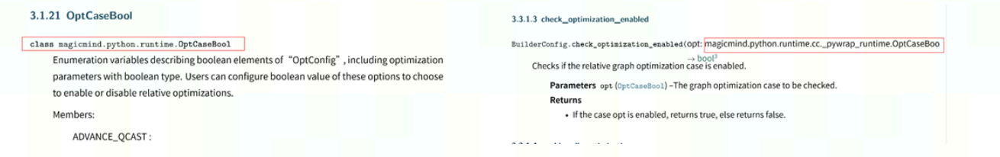

# Python API文档配置及规范

## Sphinx编译环境搭建

Sphinx是一种基于Python的文档工具，所以支持直接将python的.py文件解析生成PDF和HTML。然而sphinx对 module的直接解析无法对class, function, method生成目录结构，因此需要将class, function, method通过在RST文件中调用sphinx auto-doc的指令来架构PDF文档。

完整项目搭建说明，可参考：

<https://blog.csdn.net/sinat_29957455/article/details/83657029>

## Sphinx 指令

### Class

1. 为class创建一个文件夹，文件夹中每个rst文件为一个class.rst文件内包括class和class所有attributes, methods的调用。

2. 调用sphinx autoclass命令解析python class；调用automethod命令解析python class method。

3. class 调用命令.. autoclass:: parsejson.IConvNode 中parsejson为class所在的package+module名。示例为无需安装模块场景下，IConvNode class位于parsejson.py module中，因此写为parsejson.IConvNode。如果是安装了模块的场景，需要给出完整的package+module路径，例如magicmind.python.runtime.IConvNode，表示IConvNode是在magicmind/python/runtime路径下。

4. class method调用命令，应给出method的class名以及class所在的package+module名，例如parsejson.IConvNode.AddIConvNode，表示AddIConvNode是IConvNode class的method。

### Function

共有函数都放在一个rst文件中。可以创建一个文件夹名为function，里面有一个index.rst文件包括所有共有function。

1. 和class一样，function应给出所在的package+module名。

## 注释规范

Numpy Python style guide: <https://numpydoc.readthedocs.io/en/latest/format.html>

Google Python style guide: <https://google.github.io/styleguide/pyguide.html#38-comments-and-docstrings>

## Sphinx自动提取Python API文档

### 配置

conf.py文件中需要进行如下配置：

extensions中添加：'sphinx.ext.autodoc','sphinx.ext.autosummary','sphinx.ext.napoleon'

填写存放template模板的路径：templates_path = ['_templates']

设置autosummary：autosummary_generate = True

### 使用autosummary

1. 新建一个rst文件，用于存放autosummary指令，列出工程中的package名称。示例如下：

   ```
   .. autosummary::
      :toctree:
      :template: module-template.rst
      :recursive:
    
      python.common
      python.tcp
      python.tensor
   ```
   ```note
   :toctree: 生成目录。我司其他API文档的模块、类、函数都是会在目录中体现的，方便用户查询。
   :recursive: 用递归的方式为模块和子包生成文档。这个功能是Sphinx3.1版本新增的s。
   :template: 我们需要导入的模板名称。如果没有识别请检查conf.py文件模板路径templates_path是否配置正确。
   这里可以输入package（文件夹名称），也可以直接输入module（py文件名）。

   请注意：
   
   这个文件请勿删除，需要一直保存在工程中，否则无法同步生成一系列RST文件提取API注释。
   这个文件不要加入到index目录里，否则会生成出大量冗余信息。
   ```
   
2. 编译文档。
3. 将自动生成的package的文件名加入到index目录中。

   ```
   Python API
   ============
    
   .. toctree::
      :maxdepth: 6
    
      python.common
      python.tcp
      python.tensor
   ```


## 注意事项

1. Sphinx 将Google style注释中Args和Returns按照特殊格式生成PDF，如果你希望对补充的其他内容，如Note, Warning等按照一致格式在PDF中展现，可以在conf.py中添加如下配置。这个配置仅适用于sphinx 3.5+。

   ```
   napoleon_custom_sections = [("API Dependency", "returns_style"), ("Note", "returns_style"), ("Warning", "returns_style"), ("See Also", "returns_style"),("Examples", "returns_style"), ]
   ```

2. 在生成的PDF中，如果发现参数引用不一致时，例如：

      
	
   可以在conf.py中添加下面配置：
   
   ```
   add_module_names = True
   python_use_unqualified_type_names = True
   ```
   
3. 添加对python 标准库的链接。在conf.py中添加下面配置：

   ```
   intersphinx_mapping = {
        'python': ('https://docs.python.org/3', None),
        'numpy': ('https://numpy.org/doc/stable', None),
   }
   latex_show_urls='no'
   ```
4. 屏蔽Python API中指定函数、方法和类。

   如果使用autosummary自动生成Python API文档，想要蔽指定的method, function, class等，可以在automodule中指定不显示的method, function和class，但这需要每次手动修改。下面介绍一种方法可以自动屏蔽这些method, function, class。

   在conf.py中调用autodoc-skip-member。下面示例在文档中屏蔽了class_name类、function_name1 函数、function_name2函数和class_name.method_name方法。

   注意：方法的屏蔽需要指定所属的类，例如：class_name.method_name。
   
   ```
   # 指定不在文档中显示的method, function, class等。
   def autdoc_skip_member(app, what, name, obj, skip, options):
       if (what == "class" and name == "class_name")\
          or (what == "function" and ("function_name1" in name\
              or "function_name2" in name))\
          or (what == "method" and "class_name.method_name" in str(obj)):
           
          skip = True
       return skip
    
   def setup(app):
       app.connect('config-inited', config_inited_handler)
       app.connect('build-finished',build_finished_handler)
       app.connect('builder-inited',build_inited_handler)
       #添加下面代码
       app.connect('autodoc-skip-member', autodoc_skip_member)
   ```
   
   该配置需要使用sphinx.ext.autodoc扩展包。
   
## 文档内容规范

- API介绍：

  - 一句话的简要描述：注意第三人称单数。
  - 详细的功能描述，描述中如果涉及参数等请使用 \`\` \`\`语法。
  - 使用业务场景。
  - 同类接口的使用区别。函数内部的实现原理描述、同类型函数之间的差异。
  - 如果有公式：

    - 公式展示，语法参考：数学公式写作教程【latex、rst、头文件】。
    - 公式参数介绍。
    
- 参数介绍：

  - 参数类型：该参数的数据类型。
  - 描述：说明该参数的含义。
  - 写明该参数是输入参数还是输出参数。
  - 说明是optional还是required。
  - 如果有默认值、单位或取值范围，也请写清楚。

- 返回值：

  - 详细的返回值说明。返回值是用来做什么的，如果是指针需要说明。 返回值应包括成功和失败分别返回的内容。
  
- 注意事项：

  - 列表的格式请使用 *，一二级列表间请注意空行。