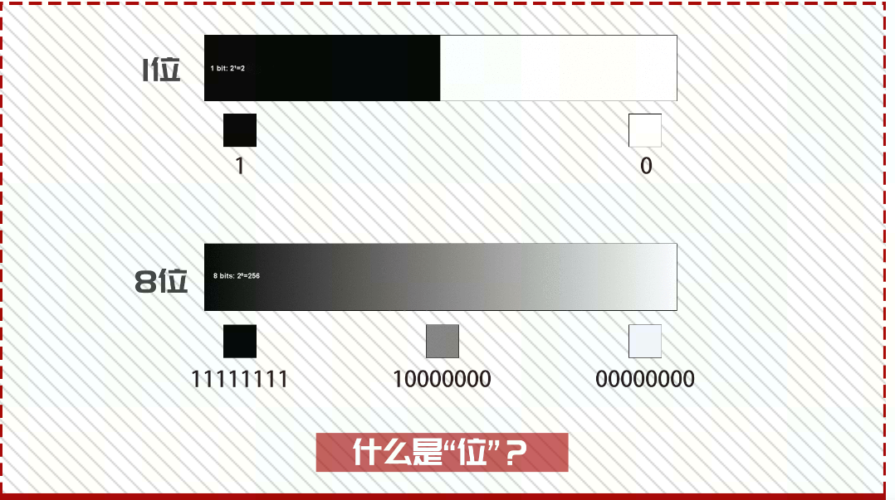
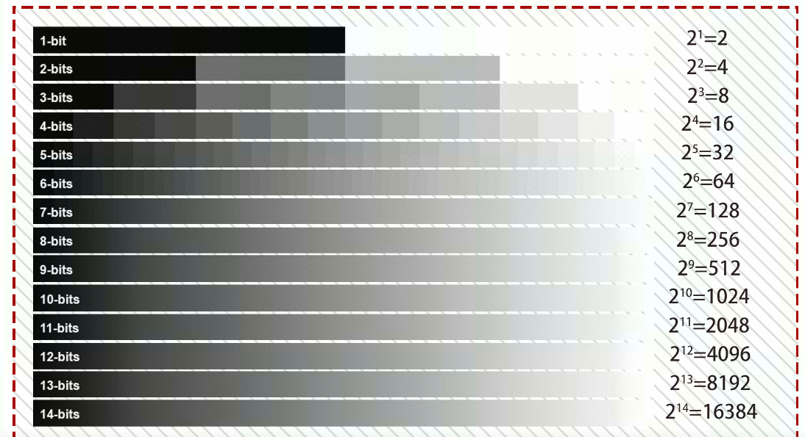

# 16位图像转换为8位图像

简单的说，色彩深度是指每个像素可以显示的颜色数，一般是用“位”或“Bit”为单位来描述。位数越多，可用的颜色就越多，图像的色彩表现就越准确，并且图像的文件大小也会随着位深的增加而增大，因为在高位深度的图像中，每一个像素存储了更多的颜色信息。

在进一步了解色彩深度之前，我们先来讨论一下什么是“位（Bit）”。我们都知道，计算机是以二进制的方式处理和存储信息的，因此任何信息进入计算机后都会变成1和0不同位数的组合，当然色彩也是如此。

如，1位的色彩深度，在计算机中只能显示0或1，所以能够展现的色彩信息只有两种白色或黑色。当我们将色彩深度提升到2位时，将出现：00、01、10、11，4（2^2）种组合方式，从而产生了相对简单的黑白灰关系。色彩深度达到3位时，将带来8（2^3）种不同的组合方式：000、001、010、011、100、101、110 和 111，黑白灰的过渡将变得更加细致。由此可见，每一次位数的增加，组合方式都会带来翻倍式的上涨。        

如之前所说，我们需要将16位图像转换为8位图像；16位图像的像素值一共有：

2^16=65536种颜色；

而8位位图像只有：

2^8=256种颜色，

传统的位数转换都是：像素值*256/65536，比如photoshop，以及matlab的im2uint8函数都是如此，在一般场景下是没有问题的，我们姑且称之为“真转换”，而如果是labelme得到的label.png标注图像在进行转换时，由于每个类别的像素值从0开始赋值，如0，1，2，3，4.......如果进行“真转换”的话，由于这些值都太小，基本转换后的像素值都是（0，1）之间，所以都变成了0，所以我们需要将16位转换位8位的时候还保留住原来的像素值，这种只改变位数，而不改变具体数值的转换方法，姑且称之为“伪转换”；

参考文献：
<https://blog.csdn.net/qq_15969343/article/details/79841446>