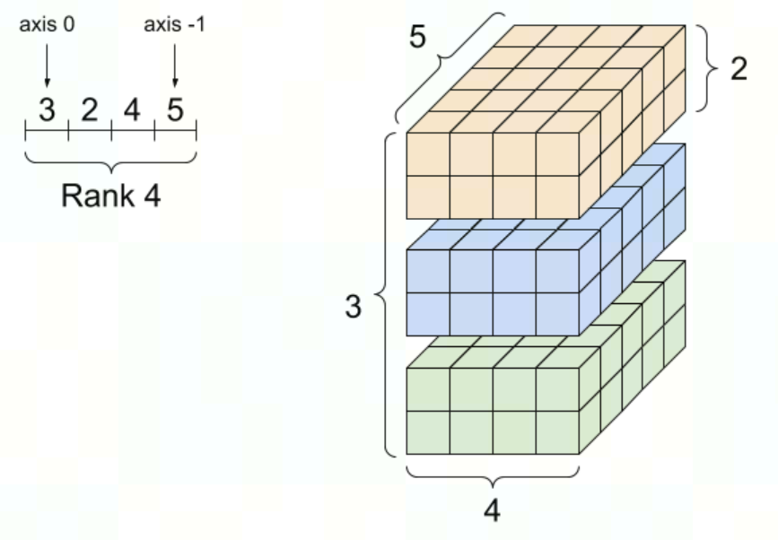
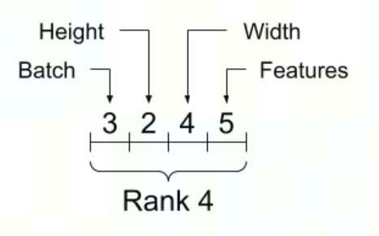
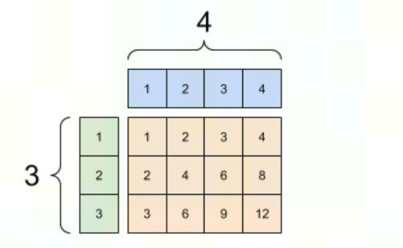

# Tensor笔记

## Shapes

- Shape: The length (number of elements) of each of the axes of a tensor.
- Rank: Number of tensor axes. A scalar has rank 0, a vector has rank 1, a matrix is rank 2.
- Axis or Dimension: A particular dimension of a tensor.
- Size: The total number of items in the tensor, the product of the shape vector's elements.

```
A rank-4 tensor, shape: [3, 2, 4, 5]
```



While axes are often referred to by their indices, you should always keep track of the meaning of each. Often axes are ordered from global to local: The batch axis first, followed by spatial dimensions, and features for each location last. This way feature vectors are contiguous regions of memory.

Typical axis order



## Broadcasting

Broadcasting is a concept borrowed from the equivalent feature in NumPy. In short, under certain conditions, smaller tensors are "stretched" automatically to fit larger tensors when running combined operations on them.

The simplest and most common case is when you attempt to multiply or add a tensor to a scalar. In that case, the scalar is broadcast to be the same shape as the other argument.

A broadcasted add: a [3, 1] times a [1, 4] gives a [3,4]



Most of the time, broadcasting is both time and space efficient, as the broadcast operation never materializes the expanded tensors in memory.

参考文献：<https://www.tensorflow.org/guide/tensor>
