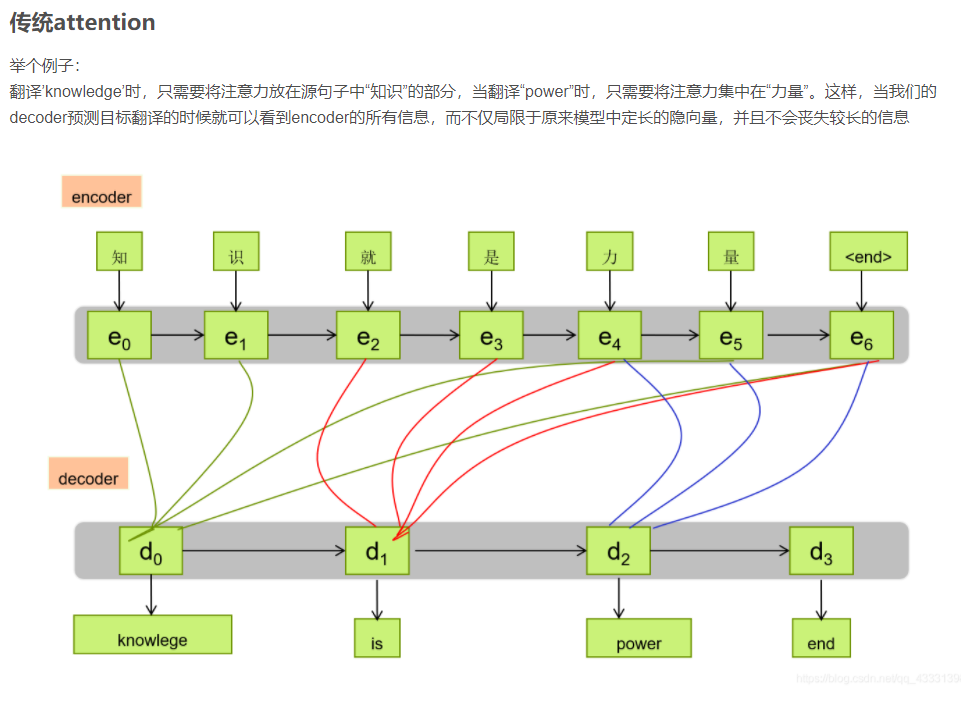
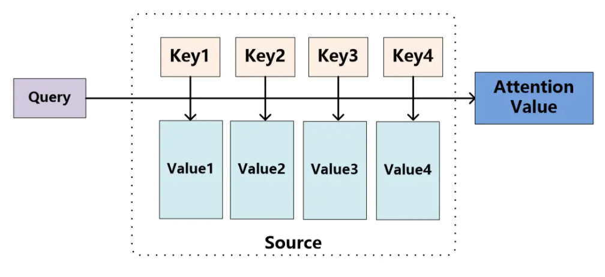
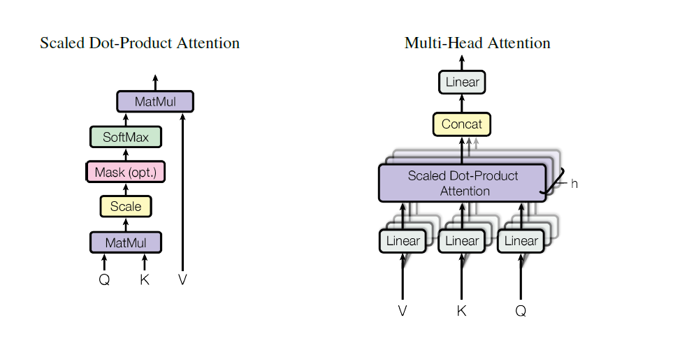

# Attention & Multi-Head Attention 学习笔记

## Attention

An attention function can be described as mapping a query and a set of key-value pairs to an output,
where the query, keys, values, and output are all vectors. The output is computed as a nodeed sum
of the values, where the node assigned to each value is computed by a compatibility function of the
query with the corresponding key.

## Multi-Head Attention
Instead of performing a single attention function with dmodel-dimensional keys, values and queries,
we found it beneficial to linearly project the queries, keys and values h times with different, learned
linear projections to dk, dk and dv dimensions, respectively. On each of these projected versions of
queries, keys and values we then perform the attention function in parallel, yielding dv-dimensional
output values. These are concatenated and once again projected, resulting in the final values.

一个Attention的计算结果，即output被成为head。Multi-head就是多个attention的计算结果。

## VS Multi-Head Attention
Multi-Head Attention consists of several attention layers running in parallel.

## Applications of Attention in our Model

For translation tasks, the Transformer can be trained significantly faster than architectures based
on recurrent or convolutional layers. On both WMT 2014 English-to-German and WMT 2014
English-to-French translation tasks, we achieve a new state of the art. In the former task our best
model outperforms even all previously reported ensembles.

## 参考文献：

<https://www.jianshu.com/p/e647d3a10d9c>

<https://blog.csdn.net/qq_43331398/article/details/103192522>

<https://papers.nips.cc/paper/2017/file/3f5ee243547dee91fbd053c1c4a845aa-Paper.pdf>